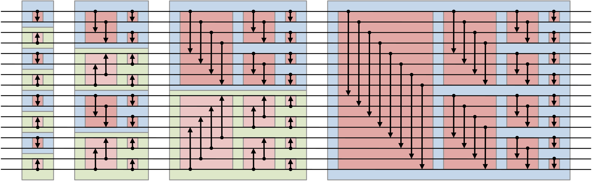

# Sorting
We have a 1D tensor of any size. This repo contains cuda kernels to tackle this problem

## Bitonic Sort.
This is a sort which is using fixed comparision pattern to rearrange the elements of an array
in sorted order. This sorting method is unstable (that is relative position of elements are not preserved). Another limitation is that it only works on array whose size is power of 2s.

General algorithm is as follows:
```c++
    // given an array arr of length n, this code sorts it in place
    // all indices run from 0 to n-1
    for (k = 2; k <= n; k *= 2) // k is doubled every iteration
        for (j = k/2; j > 0; j /= 2) // j is halved at every iteration, with truncation of fractional parts
            for (i = 0; i < n; i++)
                l = bitwiseXOR (i, j); // in C-like languages this is "i ^ j"
                if (l > i)
                    if (  (bitwiseAND (i, k) == 0) AND (arr[i] > arr[l])
                       OR (bitwiseAND (i, k) != 0) AND (arr[i] < arr[l]) )
                          swap the elements arr[i] and arr[l]
```
Visualization: Comparision on a 16 element array.


## Radix Sort.

## References
- Bitonic sort, Wikipedia : [here](https://en.wikipedia.org/wiki/Bitonic_sorter)